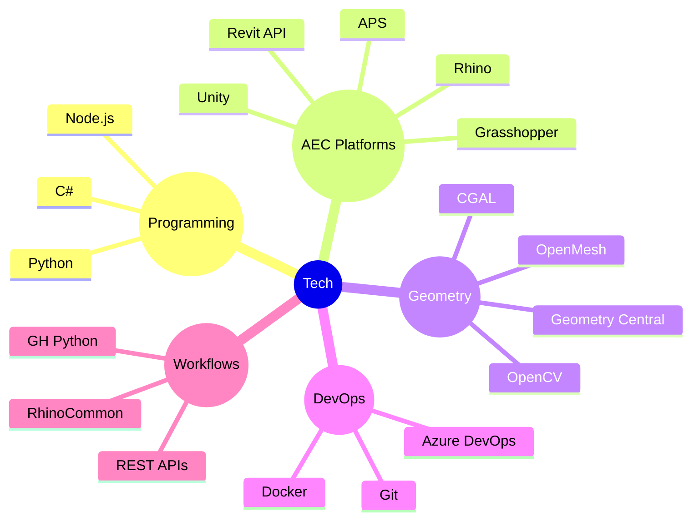

# Shylesh Kumar
Computational Designer — AEC Technologist — Architect  

Architect-turned-developer focused on computational design, geometry, and automation workflows for the AEC industry.

---

## Tools

---

## Overview

| Focus | Contact |
|-------|--------|
| Computational Geometry AEC Automation Digital Fabrication Spatial Data Systems Real-time Systems | [Portfolio](https://shylesh-kumar.netlify.app/) [LinkedIn](https://www.linkedin.com/in/shyleshkumar007/) [Upwork](https://www.upwork.com/freelancers/~012a5d23186dc641eb) |

---

## Work

| Name | Description | Link | Status | Tech Stack |
|-----|-------------|------|--------|------------|
| Spatial Intelligence | Geospatial housing prediction system using Dubai datasets | https://github.com/Darkwolf007/Spatial_Intelligence_RealEstate | Completed | Python · GIS · Data |
| Immersive Mahabalipuram | Photogrammetry + gaussian splatting optimized for web | https://github.com/Darkwolf007 | Completed | Three.js · WebGL · SplatJS |
| SQL Chatbot Pack | PDF → embeddings → LLM-powered query pipeline | https://github.com/Darkwolf007/sql_chatbot_pack | Completed | Python · LLM · Vector DB |
| CGALWrapper | Native CGAL integration in Grasshopper via C++/C# interop | https://github.com/Darkwolf007/CGALWrapper | Work in Progress | C++ · C# · Rhino |
| Modular Fabrication Toolkit | Parametric system for robotic fabrication workflows | https://github.com/Darkwolf007 | Work in Progress | C# · Grasshopper |

---

## Stats

  

---

## Activity

  

